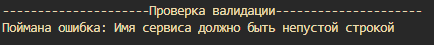
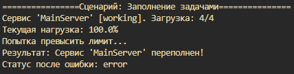
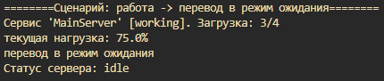
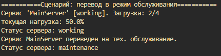
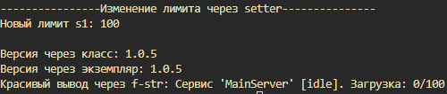
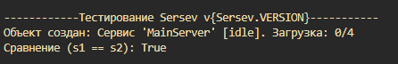

# Лабораторная работа №1 (вариант 8)
## Предметная область
Сервер
Сервер Включает в себя:
- Статус
- Нагрузку
- Имя

Все эти значения могут быть разными, а зависимости от конкретного сервера

## Обьект __Что является сущностью?__
Реальизованный класс Sersev хранит в себе данные о загрузке и выполняемых задачах.

## свойства обьекта (Какие у него атрибуты?)
### Атрибуты класса
- VERSION - версия программы
### Атрибуты обьекта (экземпляра)
- name - имя сервера(Main server или тиро того)
- status - статус сервера (работает/в ожидании и т.д.)
- max_tasks - максимальное кол-во задач, которые сервер может выполнять одновременно
- load_percentage - степень загрузки сервера (% заагрузки от амкс. кол-ва задач) (вычисляемый)

## __Какие инварианты?__
- Name не может быть пустой строкой
- max_tasks всегда int>0
- _tasks не может привышать max_tasks
- статус сервера всегда соотв. значению из ServiceStatus
 ## метод \_\_eq__ (Что значит «равенство»?)
 - имена совпадают
 - max_tasks - совпадают

## Класс состояний ServiceStatus (Есть ли состояние?)
- idle - ожидает
- working - работает
- error - в состоянии ошибки
- maintenance - на обслужиаывании

## Методы
- add_task - добавление задачи
- clear_tasks - отмена всех задач и переход в режим ожидания
- set_maintenance - перевод на тех обслуживание

## @property - превращение метода класса в атрибут (свойство)
- дает динамическое вычисление (типо обновление процентов загрузки)
- защита данных (запрещает менять неизменные данные)
- позвалает обращаться к атрибуту без скобок
- чтение _name  и подобных

##   repr
- выводит данные "Не красиво" (для разработчика) (возвращает строковое представление обьекта)
- по выходным данным, в идеале, можно создать идеинтичный обьект

## Cценарии работы и примеры работы
- __Проверка__ \

- __Сценарий 1__ \

- __сценарий 2__ \

- __сценарий 3__ \

- __setter__ \

- __Тестирование__ __eq__ \

