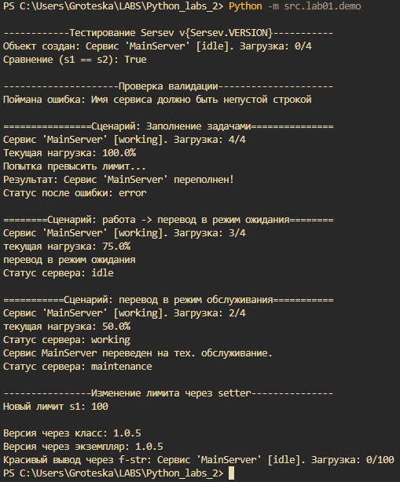

# Лабораторная работа №1
## вариант 8
### model.py
```Python
class ServiceStatus(Enum):
    IDLE = "idle"
    WORKING = "working"
    ERROR = "error"
    MAINTENANCE = "maintenance"

class Sersev:
    VERSION = "1.0.5"

    def __init__(self, name: str, max_tasks: int = 10):
        # Закрытые атрибуты экземпляра
        self._name = self._validate_name(name)
        self._max_tasks = self._validate_max_tasks(max_tasks)
        self._tasks = []
        self._status = ServiceStatus.IDLE

    # --- Методы валидации (не дублируют код) ---
    def _validate_name(self, name: str) -> str:
        if not isinstance(name, str) or len(name.strip()) == 0:
            raise ValueError("Имя сервиса должно быть непустой строкой")
        return name.strip()

    def _validate_max_tasks(self, limit: int) -> int:
        if not isinstance(limit, int) or limit <= 0:
            raise ValueError("Лимит задач должен быть целым числом больше 0")
        return limit

    # --- Свойства (Properties) ---
    @property
    def name(self):
        return self._name

    @property
    def status(self):
        return self._status.value

    @property
    def load_percentage(self):
        """Пример вычисляемого свойства"""
        return (len(self._tasks) / self._max_tasks) * 100

    @property
    def max_tasks(self):
        return self._max_tasks

    @max_tasks.setter
    def max_tasks(self, value: int):
        # Валидация при изменении через сеттер
        new_limit = self._validate_max_tasks(value)
        if new_limit < len(self._tasks):
            raise ValueError("Новый лимит меньше текущего количества задач!")
        self._max_tasks = new_limit

    # --- Бизнес-методы и состояние ---
    def add_task(self, task_name: str):
        """Добавление задачи с проверкой состояния"""
        if self._status == ServiceStatus.ERROR:
            raise RuntimeError("Нельзя добавить задачу: сервис в состоянии ERROR")
        
        if len(self._tasks) >= self._max_tasks:
            self._status = ServiceStatus.ERROR # Меняем состояние при перегрузке
            raise OverflowError(f"Сервис '{self._name}' переполнен!")
            
        self._tasks.append(task_name)
        self._status = ServiceStatus.WORKING

    def clear_tasks(self):
        """Очистка и перевод в режим ожидания"""
        self._tasks.clear()
        self._status = ServiceStatus.IDLE

    def set_maintenance(self):
        """Метод изменения состояния"""
        self._status = ServiceStatus.MAINTENANCE
        print(f"Сервис {self._name} переведен на тех. обслуживание.")

    # --- Магические методы ---
    def __str__(self):
        return f"Сервис '{self._name}' [{self._status.value}]. Загрузка: {len(self._tasks)}/{self._max_tasks}"

    def __repr__(self):
        return f"Sersev(name='{self._name}', max_tasks={self._max_tasks})"

    def __eq__(self, other):
        if not isinstance(other, Sersev):
            return False
        # Считаем сервисы равными, если у них одинаковые имена и лимиты
        return self._name == other._name and self._max_tasks == other._max_tasks
```

### demo.py
```python
from .model import Sersev
from ..line_lining import line_line

def run_demo():
    print()
    print(line_line(row="Тестирование Sersev v{Sersev.VERSION}", ln=60, dot="-"))

    # 1. Успешное создание
    s1 = Sersev("MainServer", max_tasks=4)
    s2 = Sersev("MainServer", max_tasks=4)
    print(f"Объект создан: {s1}")
    print(f"Сравнение (s1 == s2): {s1 == s2}")

    # 2. Демонстрация валидации при создании
    print()
    print(line_line(row="Проверка валидации", ln=60, dot="-"))
    try:
        invalid_s = Sersev("", -5)
    except ValueError as e:
        print(f"Поймана ошибка: {e}")
    
    # 3. Работа с бизнес-логикой и состояниями
    print()
    print(line_line(row="Сценарий: Заполнение задачами", ln=60))
    try:
        s1.add_task("Data Indexing")
        s1.add_task("Backup")
        s1.add_task("Log Rotation")
        s1.add_task("Updating logs")
        print(s1)
        print(f"Текущая нагрузка: {s1.load_percentage}%")
        
        print("Попытка превысить лимит...")
        s1.add_task("overcharge")
    except Exception as e:
        print(f"Результат: {e}")
        print(f"Статус после ошибки: {s1.status}")

    s1.clear_tasks()
    print()
    print(line_line(row="Сценарий: работа -> перевод в режим ожидания", ln=60))
    s1.add_task("Backup")
    s1.add_task("Updating logs")
    s1.add_task("Uploaading_data")
    print(s1)
    print(f"текущая нагрузка: {s1.load_percentage}%")
    print("перевод в режим ожидания")
    s1.clear_tasks()
    print(f"Статус сервера: {s1.status}")
    print()
    print(line_line("Сценарий: перевод в режим обслуживания",60))
    s1.add_task("Backup")
    s1.add_task("Updating logs")
    print(s1)
    print(f"текущая нагрузка: {s1.load_percentage}%")
    print(f"Статус сервера: {s1.status}")
    s1.set_maintenance()
    print(f"Статус сервера: {s1.status}")

    # 4. Работа сеттера
    print()
    print(line_line(row="Изменение лимита через setter", ln=60, dot="-"))
    s1.clear_tasks()
    s1.max_tasks = 100
    print(f"Новый лимит s1: {s1.max_tasks}")

    # 5. Атрибут класса
    print(f"\nВерсия через класс: {Sersev.VERSION}")
    print(f"Версия через экземпляр: {s1.VERSION}")

if __name__ == "__main__":
    run_demo()
```
